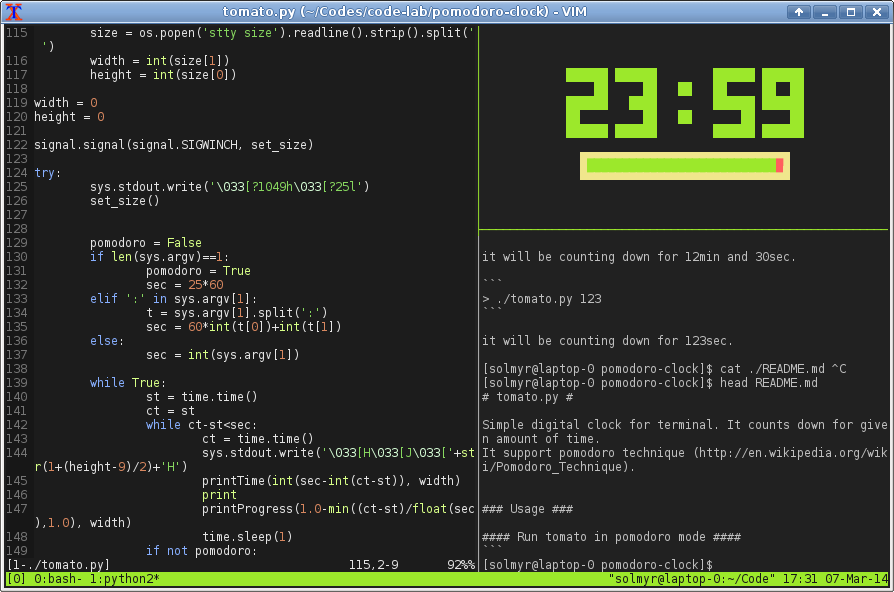

# tomato.py #

Simple digital clock for linux terminal. It counts down for given amount of time. 
It support pomodoro technique (http://en.wikipedia.org/wiki/Pomodoro_Technique).


### Usage ###

#### Count down for given time ####
```
> ./tomato.py 12:30
```

it will be counting down for 12min and 30sec.

```
> ./tomato.py 123
```

it will be counting down for 123sec.

#### Run tomato in pomodoro mode ####
```
> ./tomato.py
```

It will count down for 25min, after that it will require confirm to count down for 5min (break-time) and then it again start from begin.


### Screenshots ###
tomato.py in tmux session:


